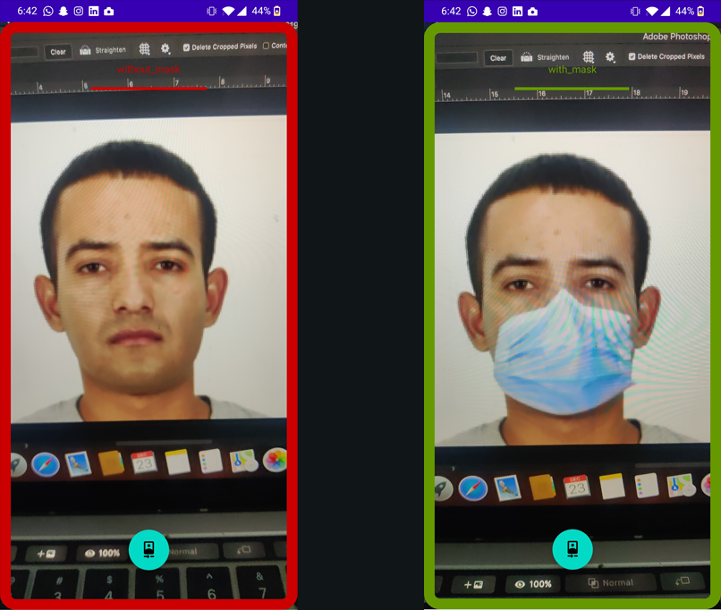

# FaceMaskDetection-Android
Taking advantage of lightweight deep learning models on mobile devices.   
Face Mask Detection on Android using TensorFlow Lite with MobileNetV2 image classifier.

Used TocoConverter python class to migrate from the Keras ‘.h5’ format to the TensorFlow Lite ‘.tflite’ format.     
```
import tensorflow.lite as lite

input_file = "mask_detector.model"
output_file = "mask_detector.tflite"

converter = lite.TocoConverter.from_keras_model_file(input_file)
tflite_model = converter.convert()
open(output_file, "wb").write(tflite_model)
```     

The model was conveniently created by using transfer learning over the MobileNetV2 architecture, producing a ‘.h5’ file. 
After TensorFlow Lite conversion, the resulting file is very light-weight, really good for a mobile application.      


## Preview   


